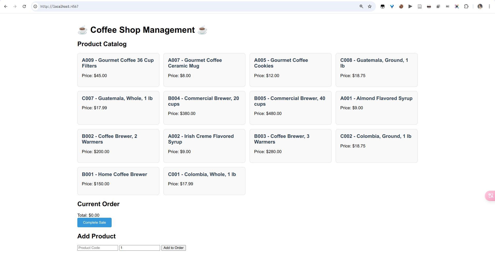

# ☕ Coffee Shop Management System

[](https://openjdk.org/)
[](https://sparkjava.com/)
[](LICENSE)

A modern coffee shop management system with web interface, supporting product catalog management, order processing and sales analytics.



## ✨ Features

### 前端功能
- 🗂️ 产品目录浏览（咖啡/冲泡机/配件）
- 🛒 实时订单管理（添加/删除商品）
- 💰 一键完成销售交易
- 📊 销售数据可视化（开发中）

### 后端功能
- ✅ 产品代码格式验证（A001/B002/C003）
- 📦 自动合并重复订单项
- 📈 销售数据聚合统计
- 🚦 RESTful API 支持

## 🚀 快速开始

### 环境要求
- JDK 17+
- Maven 3.6+

### 安装运行
```bash
# 克隆仓库
git clone https://github.com/littflower/coffee-web.git
cd coffee-web

# 构建项目（包含依赖）
mvn clean package

# 启动服务
java -jar target/coffee-web-1.0-shaded.jar

# 访问 http://localhost:4567
```

## 📚 技术栈

### 后端
- **核心框架**: SparkJava
- **JSON 处理**: Gson
- **依赖管理**: Maven
- **构建工具**: Maven Shade Plugin

### 前端
- **UI 框架**: 原生 JavaScript
- **样式**: CSS Grid/Flexbox
- **交互**: Fetch API

## 📂 项目结构
```
coffee-web/
├── src/
│   ├── main/
│   │   ├── java/
│   │   │   └── com/
│   │   │       └── example/
│   │   │           ├── WebMain.java          # Web入口
│   │   │           └── cli/                  # 原始CLI核心逻辑
│   │   └── resources/
│   │       └── public/                       # 前端资源
│   │           ├── index.html
│   │           ├── style.css
│   │           └── app.js
├── pom.xml                                   # Maven配置
└── README.md
```

## 📝 开发指南

### API 文档
| 端点                   | 方法   | 描述                 |
|-----------------------|--------|----------------------|
| `/api/products`       | GET    | 获取所有产品         |
| `/api/products/:code` | GET    | 获取指定产品详情     |
| `/api/order`          | GET    | 获取当前订单         |
| `/api/order/items`    | POST   | 添加商品到订单       |
| `/api/sales`          | POST   | 完成当前订单销售     |

### 贡献代码
1. Fork 本仓库
2. 创建特性分支 (`git checkout -b feature/awesome-feature`)
3. 提交修改 (`git commit -m 'Add awesome feature'`)
4. 推送分支 (`git push origin feature/awesome-feature`)
5. 创建 Pull Request

## 📄 许可证
This project is licensed under the MIT License - see the [LICENSE](LICENSE) file for details.

---

> 🌟 **提示**：系统初始化时会自动加载示例数据，包含：
> - 5种咖啡配件（A001-A009）
> - 5种咖啡冲泡机（B001-B005）
> - 4种咖啡豆（C001-C008）
